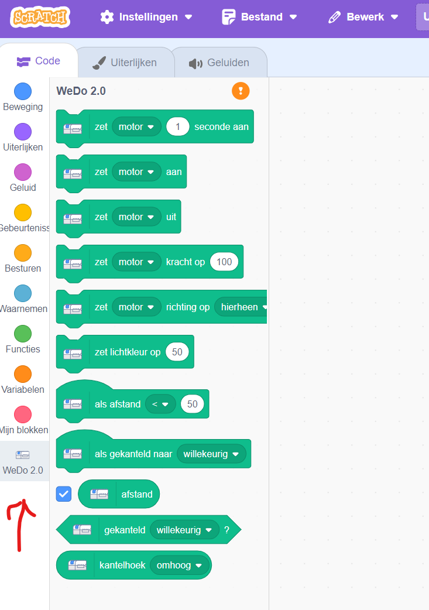
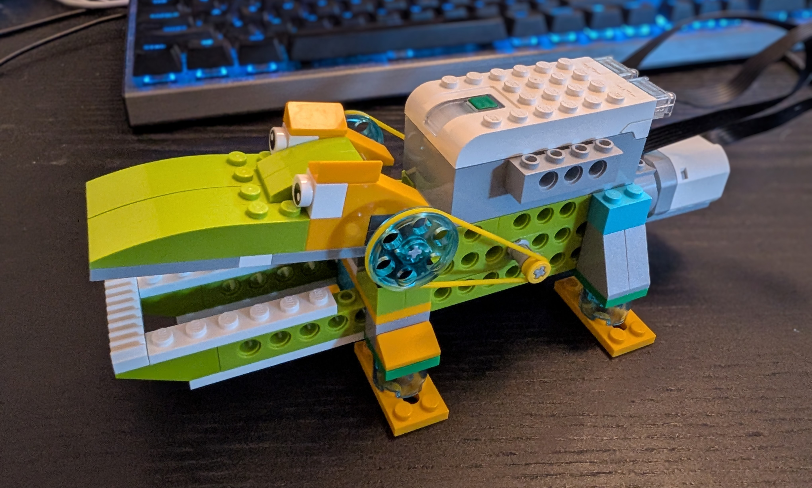

# krokodil
Een project voor de bibliotheek Heerenveen waar we met lego een krokodil bouwen die we met scratch laten happen. 

## Wat heb je nodig
- LEGO Education WeDo 2.0
- een laptop met internet
- Scratch, Ga naar https://scratch.mit.edu/
- Schakel de WeDo extensie in, zodat er aan de linkerkant de volgende optie beschikbaar wordt:
. Deze extensie maakt gebruik van Scratch Link. Dit is reeds geinstalleerd op de laptop.

## Welkom 
Onderstaande stappen laten je kennis maken met alle onderdelen. Probeer eerst zelf de oplossing te maken. Bij iedere stap zit een uitwerking, deze kun je bekijken als je zelf er even niet uitkomt.

## Krokodil bouwen (stap1)
**wat moet je doen?** Zorg ervoor dat je een krokodil bouwt. het makkelijkste is door de instructies te volgen. 
Zelf goede ideeen? Gewoon doen. Belangrijk is dat de motor en de bewegingssensor goed zitten. En uiteraard dat je met de motor de bek van de krodil open en dicht kunt maken. 

> [!TIP]
> Begin met de standaard krokodil en verander hem als alles goed werkt.

<details>
<summary>uitwerking: Welkom (stap1)</summary>



</details>

## De bek van de krokodil gaat open (stap2)
**doel:** maak een programma die de bek van de krokodil open doet als je het programma startn.
**wat moet je doen?** bouw in scratch een start. Laat de bek open gaan en na een paar seconden weer automatisch dicht.

> [!TIP]
> Voor deze stap moet je de WeDo motor besturen. 


<details>
<summary>uitwerking: Krodil bek open (stap2)</summary>


```javascript
input.onButtonPressed(Button.A, function () {
    music.play(music.tonePlayable(262, music.beat(BeatFraction.Whole)), music.PlaybackMode.UntilDone)
    for (let index = 0; index < 3; index++) {
        pins.digitalWritePin(DigitalPin.P0, 1)
        basic.pause(100)
        pins.digitalWritePin(DigitalPin.P0, 0)
        basic.pause(100)
    }})
```
</details>


## De bek gaat dicht als je er iets in stopt (stap3)
**doel:** bewegingsensor gebruiken en de motor activeren.
**wat moet je doen?** aansluiten bewegingssensor en zorgen dat het alarm afgaat als iemand in de buurt komt.

<details>
<summary>uitwerking: Boef gedetecteerd (stap3)</summary>


```javascript
basic.forever(function () {
    if (grove.measureInInches(DigitalPin.P1) < 10) {
        basic.showIcon(IconNames.No)
    } else {
        basic.showIcon(IconNames.Yes)
    }})
```
</details>


## hoe wil je het inbraakalarm uitbreiden? (extra stap)
**surgesties:**  
* led strip gebruiken ipv led [moeilijkheidsgraad: MIDDEN]
* tellen hoe vaak het alarm is afgegaan en op het schermpje tonen [moeilijkheidsgraad: MIDDEN]
* radio sigaal doorsturen naar de tweede micro.bit [moeilijkheidsgraad: MOEILIJK]
