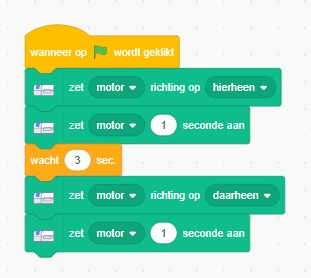
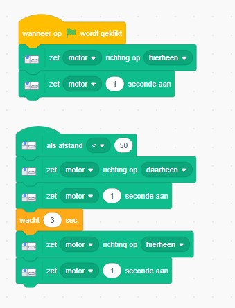
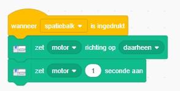

# krokodil
Een project voor de bibliotheek Heerenveen waar we met lego een krokodil bouwen die we met scratch laten happen. 

## Wat heb je nodig
- LEGO Education WeDo 2.0
- een laptop met internet
- Scratch, Ga naar https://scratch.mit.edu/
- Schakel de WeDo extensie in, zodat er aan de linkerkant de volgende optie beschikbaar wordt (zie screenshot):
. De WeDo extensie maakt gebruik van Scratch Link. Dit is al voor geinstalleerd op de laptop.

screemshot: LEGO WeDO2.0 in scratch

## Welkom 
Onderstaande stappen laten je kennis maken met alle onderdelen. Probeer eerst zelf de oplossing te maken. Bij iedere stap zit een uitwerking, deze kun je bekijken als je zelf er even niet uitkomt.

## Krokodil bouwen (stap1)
**wat moet je doen?** Zorg ervoor dat je een krokodil bouwt. het makkelijkste is door de instructies te volgen. 
Zelf goede ideeen? Gewoon doen. Belangrijk is dat de motor en de bewegingssensor goed zitten. En uiteraard dat je met de motor de bek van de krodil open en dicht kunt maken. 

> [!TIP]
> Begin met de standaard krokodil en verander hem als alles goed werkt.

uitwerking: Welkom (stap1)

## De bek van de krokodil gaat open (stap2)
**doel:** maak een programma die de bek van de krokodil open doet als je het programma startn.
**wat moet je doen?** bouw in scratch een start. Laat de bek open gaan en na een paar seconden weer automatisch dicht.

> [!TIP]
> Voor deze stap moet je de WeDo motor besturen. 

uitwerking: Krodil bek open (stap2)

## De bek gaat dicht als je er iets in stopt (stap3)
**doel:** afstandsensor gebruiken en de motor activeren.
**wat moet je doen?** Lees de afstandsensor uit en zorg dat de krokodil bek hapt. 

uitwerking: Krokodil hapt (stap3)

### testen
Om te kijken of alles goed werkt kun je een code toevoegen om goed te kunnen testen. Laat de krokodil zijn bek openen als je op bijvoorbeeld de spatiebalk drukt van de laptop.

uitwerking: Krokodil hapt (stap3 testen)

### scratch project (achtergrond)
<https://scratch.mit.edu/projects/1215414544>

### credits 
<https://robotics.benedettelli.com/lego-wedo2-crocodile/>